# LigAlign: GPU-Accelerated Ligand Pose Prediction

Fast, differentiable 3D ligand pose prediction using MCS alignment and PyTorch Vina scoring.

## Features

- **GPU-Accelerated Pipeline**: Conformer generation, alignment, and scoring on GPU
- **MCS-Based Alignment**: Uses reference ligand structure as template
- **Differentiable Vina Scoring**: Full 5-term AutoDock Vina scoring in PyTorch
- **Gradient-Based Optimization**: Optimize all poses via torsion angle backpropagation
- **Flexible Clustering**: RMSD-based conformer clustering

## Installation

```bash
# Install with uv (recommended)
uv venv
source .venv/bin/activate  # or .venv\Scripts\activate on Windows
uv pip install torch numpy rdkit scipy
```

## Quick Start

### Python API (Recommended for Jupyter/Scripts)

```python
from lig_align import run_pipeline

# Basic usage
results = run_pipeline(
    protein_pdb="protein.pdb",
    ref_ligand="ref.sdf",
    query_ligand="CC(C)Cc1ccc(cc1)C(C)C(=O)O",  # SMILES or SDF path
    output_dir="output/"
)

print(f"Best score: {results['best_score']:.2f} kcal/mol")
print(f"Output: {results['output_file']}")

# With optimization (recommended)
results = run_pipeline(
    protein_pdb="protein.pdb",
    ref_ligand="ref.sdf",
    query_ligand="SMILES",
    num_confs=1000,
    rmsd_threshold=1.0,
    optimize=True,
    optimizer="lbfgs"
)

# Batch processing
for name, smiles in molecules.items():
    results = run_pipeline(
        protein_pdb="protein.pdb",
        ref_ligand="ref.sdf",
        query_ligand=smiles,
        output_dir=f"output_{name}",
        verbose=False
    )
    print(f"{name}: {results['best_score']:.2f} kcal/mol")
```

See [examples/notebook_api_examples.ipynb](examples/notebook_api_examples.ipynb) for more examples.

### Command Line Usage

```bash
# Basic prediction
python scripts/run_pipeline.py \
    -p data/protein.pdb \           # Protein pocket
    -r data/ref_ligand.sdf \        # Reference ligand
    -q "CC(C)CC1=CC..." \           # Query SMILES or SDF file
    -o output/                      # Output directory

# With optimization (recommended)
python scripts/run_pipeline.py \
    -p data/protein.pdb \
    -r data/ref_ligand.sdf \
    -q "CC(C)CC1=CC..." \
    -n 1000 \                       # Generate 1000 conformers
    --rmsd_threshold 1.0 \          # Cluster at 1.0Å (robust default)
    --optimize \                    # Enable gradient optimization
    --opt_batch_size 8              # Optimize 8 poses simultaneously
```

## Command Reference

### Main Pipeline: `run_pipeline.py`

**Required Arguments:**
```bash
-p, --protein PROTEIN          # Protein pocket PDB file
-r, --ref_ligand REF_SDF       # Reference ligand SDF file
-q, --query_ligand QUERY       # Query ligand (SMILES string or SDF file)
```

**Optional Arguments:**
```bash
-o, --out_dir OUT_DIR          # Output directory (default: current directory)
-n, --num_confs NUM            # Number of conformers to generate (default: 1000)
--rmsd_threshold FLOAT         # RMSD clustering threshold in Å (default: 1.0)

# MCS Alignment Options
--mcs_mode MODE                # MCS mode: single|multi|cross (default: single)
                               #   single: 1:1 alignment (fastest)
                               #   multi: 1:N for symmetric reference
                               #   cross: N:M for both symmetric
--min_fragment_size INT        # Min atoms per fragment for cross mode (default: 5)
--max_fragments INT            # Max fragments for cross mode (default: 3)

# Optimization Options
--optimize                     # Enable gradient-based torsion optimization
--opt_batch_size INT           # Batch size for optimization (default: 8)
--optimizer OPTIMIZER          # Optimizer: adam|adamw|lbfgs (default: adam)
--no_mmff                      # Disable MMFF relaxation after coordinate surgery
--free_mcs                     # Allow MCS atoms to optimize (default: frozen)

# Scoring Options
--torsion_penalty              # Apply torsional entropy penalty
--weight_preset PRESET         # Scoring weights: vina|vina_lp|vinardo (default: vina)
```

**Examples:**

```bash
# Example 1: Basic prediction without optimization
python scripts/run_pipeline.py \
    -p examples/10gs/10gs_pocket.pdb \
    -r examples/10gs/10gs_ligand.sdf \
    -q "CCO" \
    -o output/

# Example 2: Full pipeline with optimization (recommended settings)
python scripts/run_pipeline.py \
    -p protein.pdb \
    -r ref_ligand.sdf \
    -q "CC(C)CC1=CC=C(C=C1)C(C)C(=O)O" \
    -n 1000 \
    --rmsd_threshold 1.0 \
    --optimize \
    --opt_batch_size 16

# Example 3: Using SDF file as query
python scripts/run_pipeline.py \
    -p protein.pdb \
    -r ref_ligand.sdf \
    -q query_ligand.sdf \
    --optimize

# Example 4: Vinardo scoring with free MCS
python scripts/run_pipeline.py \
    -p protein.pdb \
    -r ref_ligand.sdf \
    -q "SMILES_STRING" \
    --weight_preset vinardo \
    --free_mcs \
    --optimize

# Example 5: Using different optimizers
python scripts/run_pipeline.py \
    -p protein.pdb \
    -r ref_ligand.sdf \
    -q "SMILES_STRING" \
    --optimize \
    --optimizer lbfgs  # or adam, adamw (default: adam)
```

### Optimize Existing Pose: `optimize_pose.py`

Optimize a single ligand pose without conformer generation or alignment.

```bash
python scripts/optimize_pose.py \
    -p protein.pdb \              # Protein pocket PDB
    -l ligand.sdf \               # Ligand SDF with 3D coordinates
    -o optimized.sdf \            # Output SDF file
    --steps 200 \                 # Optimization steps (default: 100)
    --lr 0.05 \                   # Learning rate (default: 0.05)
    --optimizer lbfgs \           # adam|adamw|lbfgs (default: adam)
    --torsion_penalty \           # Apply torsional entropy penalty
    --weight_preset vina          # vina|vina_lp|vinardo
```

### Compare Optimization Methods: `vis_comparison_grid.py`

Generate comprehensive 2×2 comparison grids showing 4 optimization methods with 6 analytical views each:

**4 Methods Compared:**
1. Fixed MCS + Vina
2. Free MCS + Vina
3. Fixed MCS + Vinardo
4. Free MCS + Torsion Penalty

**6 Analytical Views per Method:**
1. **3D Structure**: Initial vs Final with MCS highlighting
2. **Energy Trajectory**: Score evolution with improvement fill
3. **RMSD Analysis**: Overall + MCS-only structural deviation
4. **Max Atom Movement**: Peak atomic displacement tracking
5. **Energy Landscape**: Score vs RMSD scatter with trajectory
6. **Summary Statistics**: Detailed metrics box with status indicator

```bash
python scripts/vis_comparison_grid.py \
    -q "CC(C)Cc1ccc(cc1)C(C)C(=O)O" \  # Query SMILES (e.g., ibuprofen)
    -o comparison_grid.png \            # Output PNG
    -p protein.pdb \                    # Protein pocket (optional)
    -r ref_ligand.sdf \                 # Reference ligand (optional)
    --steps 100 \                       # Optimization steps
    --title "Ibuprofen"                 # Plot title prefix

# Batch generate for multiple molecules
bash run_grid_vis.sh                   # Generates 4 example grids
```

**Output**: 24-panel visualization (4 rows × 6 columns) comparing optimization strategies across multiple metrics.

## Key Parameters

| Parameter | Description | Default | Notes |
|-----------|-------------|---------|-------|
| `-n, --num_confs` | Number of conformers to generate | 1000 | Increased from 100 for better coverage |
| `--rmsd_threshold` | RMSD threshold (Å) for clustering | 1.0 | Changed from 2.0Å for robust diversity |
| `--optimize` | Enable gradient-based optimization | False | Recommended for production use |
| `--optimizer` | Optimizer type: `adam`, `adamw`, `lbfgs` | `adam` | Adam fastest, LBFGS most accurate |
| `--opt_batch_size` | Number of poses to optimize simultaneously | 8 | Adjust based on GPU memory |
| `--weight_preset` | Vina scoring weights (vina/vina_lp/vinardo) | vina | Vina for general use |

### Optimizer Comparison

| Optimizer | Speed | Accuracy | Best For | Notes |
|-----------|-------|----------|----------|-------|
| **adam** | ⚡⚡⚡ Fast | ✓ Good | Default choice | Adaptive learning rate, fast convergence |
| **adamw** | ⚡⚡⚡ Fast | ✓ Good | Large molecules | Adam + weight decay, more stable |
| **lbfgs** | ⚡ Slower (2-3×) | ✓✓ Better | High accuracy | 2nd-order method, line search |

**Recommendation**: Use `adam` (default) for speed. Use `lbfgs` if accuracy is critical and time is not a constraint.

## How It Works

### Pipeline Overview

```mermaid
graph TD
    A[Input: Protein, Reference, Query] --> B[Step 1: MCS Search]
    B --> |"MCS Mapping<br/>(ref_idx, query_idx)"| C[Step 2: Conformer Generation]

    C --> C1["Generate N conformers<br/>(ETKDG with coordMap hints)"]
    C1 --> C2["Optional: MMFF minimize<br/>(unconstrained, all atoms free)"]
    C2 --> C3["Remove Hydrogens"]
    C3 --> C4["GPU: Compute raw RMSD matrix<br/>(no alignment, just centering)"]
    C4 --> C5["Butina Clustering<br/>(RMSD threshold = 1.0Å)"]
    C5 --> |"K representatives<br/>(8-136 poses)"| D[Step 3: Coordinate Surgery]

    D --> D1["For each representative:"]
    D1 --> D2["Teleport MCS atoms<br/>to reference positions"]
    D2 --> D3["MMFF minimize<br/>(MCS atoms FIXED)"]
    D3 --> |"Aligned coordinates"| E[Step 4: Vina Scoring]

    E --> E1["Compute Vina features<br/>(vdW, hydrophobic, H-bond)"]
    E1 --> E2["5-term Vina energy<br/>(differentiable PyTorch)"]
    E2 --> E3["Intramolecular mask<br/>(exclude bonded atoms)"]
    E3 --> |"Initial scores"| F{Optimize?}

    F --> |No| H[Step 6: Output Top-K]
    F --> |Yes| G[Step 5: Torsion Optimization]

    G --> G1["Build kinematic tree<br/>(rotatable bonds)"]
    G1 --> G2["Batch all K poses<br/>(batch_size = 8)"]
    G2 --> G3["Adam/AdamW/LBFGS optimizer<br/>(100 steps, lr=0.05)"]
    G3 --> G4["Early stopping per pose<br/>(patience=30, min_delta=1e-5)"]
    G4 --> G5["Gradient clipping<br/>(max_norm=1.0)"]
    G5 --> G6["Forward kinematics<br/>(Rodrigues rotation)"]
    G6 --> |"Optimized coordinates"| G7["Rescore all poses"]
    G7 --> H

    H --> H1["Select top 3 by score"]
    H1 --> H2["Save to SDF"]

    style C4 fill:#e1f5ff
    style D3 fill:#fff4e1
    style G3 fill:#ffe1f5
    style E2 fill:#e1ffe1
```



### Key Implementation Details

#### 1. **Conformer Clustering (No Alignment)**
- **Raw RMSD Calculation**: Computes RMSD without Kabsch alignment
- **Rationale**:
  - 1000×1000 Kabsch alignment too expensive
  - Centered RMSD captures internal conformational differences
  - Representative selection happens before precise alignment

#### 2. **Coordinate Surgery with MMFF Relax**
- **Two-stage process**:
  1. **Exact placement**: Teleport MCS atoms to reference positions
  2. **Constraint minimize**: MMFF relaxation with MCS atoms fixed
- **Benefits**:
  - Removes steric clashes in non-MCS regions
  - Maintains MCS alignment constraint
  - Improves Vina scoring accuracy

#### 3. **Pose-wise Independent Early Stopping**
- Each pose converges independently
- Criteria: Energy change < 1e-5 for 30 consecutive steps
- Prevents wasting compute on converged poses

#### 4. **Batched Optimization**
```python
# Example: 136 poses optimized in batches of 8
Batch 1/17: Optimizing poses 0-7...
  Pose 3 converged at step 65
  Pose 5 converged at step 72
Batch 2/17: Optimizing poses 8-15...
  All 8 poses converged at step 58
```

### Optimization Details

**Batched Optimization** optimizes all cluster representatives simultaneously:

```python
# Example: 20 cluster centroids optimized in batches of 8
Optimizing 20 poses in 3 batches (batch_size=8)...
  Batch 1/3: Optimizing poses 0-7...
  Batch 2/3: Optimizing poses 8-15...
  Batch 3/3: Optimizing poses 16-19...
✓ Optimization complete!
  Best pose: 12 with score -8.234 kcal/mol (Δ = -1.456)
  Average improvement: -0.892 kcal/mol
```

## Performance

Tested on NVIDIA RTX PRO 6000:
- Conformer generation (200 confs): ~60ms
- Vina scoring (batch=100): ~0.4ms
- Optimization (50 steps, 8 poses): ~300ms

Optimizations applied:
- Vectorized intramolecular mask calculation
- GPU-accelerated RMSD extraction
- Precomputed feature matrices
- Cached kinematic structures


## Python API Reference

### High-Level API: `run_pipeline()`

The simplest way to use LigAlign. Returns a dictionary with all results.

```python
from lig_align import run_pipeline

results = run_pipeline(
    protein_pdb="protein.pdb",
    ref_ligand="ref.sdf",
    query_ligand="SMILES",  # or SDF path
    output_dir="output/",

    # Optional parameters
    num_confs=1000,
    rmsd_threshold=1.0,
    optimize=True,
    optimizer="lbfgs",
    verbose=True
)
```

**Returns Dictionary:**
```python
{
    'output_file': 'output/predicted_pose_top3.sdf',  # SDF file path
    'num_poses': 3,                                    # Poses saved
    'best_score': -6.038,                             # kcal/mol
    'runtime': 23.5,                                   # seconds
    'num_conformers': 1000,                           # Generated
    'num_representatives': 22,                         # Clusters
    'mcs_size': 10,                                   # MCS atoms
    'mcs_positions': 1,                               # Alignment positions
    'canonical_smiles': 'CC(C)Cc1ccc(C(C)C(=O)O)cc1', # Query
    'device': 'cuda'                                   # Device used
}
```

**All Parameters:**
```python
run_pipeline(
    # Required
    protein_pdb: str,              # Protein PDB path
    ref_ligand: str,               # Reference SDF path
    query_ligand: str,             # SMILES or SDF path
    output_dir: str = "output_predictions",

    # Conformer Generation
    num_confs: int = 1000,
    rmsd_threshold: float = 1.0,

    # MCS Options
    mcs_mode: "single"|"multi"|"cross" = "single",
    min_fragment_size: int = 5,    # For cross mode
    max_fragments: int = 3,        # For cross mode

    # Force Field
    mmff_optimize: bool = True,

    # Optimization
    optimize: bool = False,
    optimizer: "adam"|"adamw"|"lbfgs" = "adam",
    opt_steps: int = 100,
    opt_lr: float = 0.05,
    opt_batch_size: int = 8,
    freeze_mcs: bool = True,

    # Scoring
    weight_preset: "vina"|"vina_lp"|"vinardo" = "vina",
    torsion_penalty: bool = False,

    # Output
    save_all_poses: bool = None,   # Auto: True if optimize=True
    top_k: int = None,             # Auto: None if optimize=True, else 3

    # System
    device: str = None,            # Auto-detect
    verbose: bool = True
) -> dict
```

**Usage Examples:**

```python
# 1. Basic prediction
results = run_pipeline(
    protein_pdb="protein.pdb",
    ref_ligand="ref.sdf",
    query_ligand="SMILES"
)
print(f"Score: {results['best_score']:.2f} kcal/mol")

# 2. With optimization
results = run_pipeline(
    protein_pdb="protein.pdb",
    ref_ligand="ref.sdf",
    query_ligand="SMILES",
    optimize=True,
    optimizer="lbfgs"
)

# 3. Batch processing
molecules = {"Mol1": "SMILES1", "Mol2": "SMILES2"}
batch_results = []

for name, smiles in molecules.items():
    results = run_pipeline(
        protein_pdb="protein.pdb",
        ref_ligand="ref.sdf",
        query_ligand=smiles,
        output_dir=f"output_{name}",
        verbose=False  # Suppress output
    )
    batch_results.append({
        "name": name,
        "score": results['best_score'],
        "mcs": results['mcs_size'],
        "time": results['runtime']
    })

# 4. Parameter exploration
import pandas as pd

comparison = []
for n in [100, 500, 1000, 3000]:
    results = run_pipeline(
        protein_pdb="protein.pdb",
        ref_ligand="ref.sdf",
        query_ligand="SMILES",
        num_confs=n,
        verbose=False
    )
    comparison.append({
        "num_confs": n,
        "score": results['best_score'],
        "reps": results['num_representatives'],
        "time": results['runtime']
    })

df = pd.DataFrame(comparison)
print(df)

# 5. Load and analyze output
from rdkit import Chem

suppl = Chem.SDMolSupplier(results['output_file'])
poses = [mol for mol in suppl if mol is not None]

for i, mol in enumerate(poses):
    if mol.HasProp('Vina_Score'):
        score = mol.GetProp('Vina_Score')
        print(f"Pose {i+1}: {score} kcal/mol")
```

### Low-Level API: `LigandAligner`

For step-by-step control:

```python
from lig_align import LigandAligner
from lig_align.molecular import compute_vina_features
from lig_align.scoring import precompute_interaction_matrices

# Initialize
aligner = LigandAligner(device='cuda')

# 1. Find MCS
mapping = aligner.step2_find_mcs(ref_mol, query_mol)

# 2. Generate conformers
query_mol, rep_cids = aligner.step1_generate_conformers(
    query_mol, num_confs=1000, rmsd_threshold=1.0
)

# 3. Align
aligned = aligner.step3_batched_kabsch_alignment(ref_coords, query_coords, mapping)

# 4. Score
query_feat = aligner.compute_vina_features(query_mol)
pocket_feat = aligner.compute_vina_features(pocket_mol)

# Optional: Precompute for batched scoring (13% faster)
precomputed = precompute_interaction_matrices(query_feat, pocket_feat, device)

scores = aligner.step4_vina_scoring(
    aligned, pocket_coords, query_feat, pocket_feat,
    precomputed_matrices=precomputed  # Optional
)

# 5. Optimize (automatically handles single or batched)
optimized = aligner.step6_refine_pose(
    query_mol, mcs_indices, aligned, pocket_coords,
    query_feat, pocket_feat,
    num_steps=100, batch_size=8
)

# 6. Save
aligner.step5_final_selection(query_mol, rep_cids, optimized, scores, top_k=3)
```

### Common Patterns

**Success Check:**
```python
if results['best_score'] < 0:
    print("✓ Good binding predicted")
else:
    print("⚠ Poor binding")
```

**Clustering Efficiency:**
```python
ratio = results['num_representatives'] / results['num_conformers']
if ratio < 0.1:
    print("✓ Excellent diversity reduction")
elif ratio < 0.3:
    print("~ Moderate diversity")
else:
    print("⚠ High diversity - increase rmsd_threshold")
```

**Save to CSV:**
```python
import pandas as pd
df = pd.DataFrame(batch_results)
df.to_csv("results.csv", index=False)
```

**Compare Settings:**
```python
settings = [
    {"optimizer": "adam", "opt_steps": 100},
    {"optimizer": "lbfgs", "opt_steps": 50},
]

comparison = []
for setting in settings:
    results = run_pipeline(
        protein_pdb="protein.pdb",
        ref_ligand="ref.sdf",
        query_ligand="SMILES",
        optimize=True,
        verbose=False,
        **setting
    )
    comparison.append({**setting, "score": results['best_score']})

print(pd.DataFrame(comparison))
```

## Testing

```bash
# Correctness tests
uv run python tests/test_optimization_correctness.py

# New features tests
uv run python tests/test_new_features.py

# Performance benchmarks
uv run python tests/benchmark_optimizations.py
```

## Citation

If you use LigAlign in your research, please cite:

```
[Citation information to be added]
```

## License

[License information to be added]

## Requirements

- Python ≥3.12
- PyTorch ≥2.0
- RDKit ≥2023.09
- NumPy
- SciPy

## Changelog

### v0.1.0 (2026-02-26)

**New Features:**
- RMSD-based clustering (removed arbitrary `max_clusters` limit)
- Batched optimization for all cluster representatives
- Adjustable batch size for memory control

**Optimizations:**
- 15-25% faster pipeline
- Vectorized intramolecular mask calculation
- GPU-accelerated RMSD extraction
- Precomputed feature matrices for batched scoring
- Cached kinematic tree structures

**Breaking Changes:**
- `max_clusters` parameter removed from `generate_conformers_and_cluster()`
- Use `rmsd_threshold` only for clustering

**Migration:**
```python
# Before
mol, cids = aligner.step1_generate_conformers(
    mol, num_confs=100, max_clusters=30, rmsd_threshold=2.0
)

# After
mol, cids = aligner.step1_generate_conformers(
    mol, num_confs=100, rmsd_threshold=2.0
)
```

## Project Structure

```
lig-align/
├── src/lig_align/
│   ├── aligner.py               # Main LigandAligner API
│   │
│   ├── molecular/               # Molecular structure analysis
│   │   ├── mcs.py              # Maximum Common Substructure search
│   │   ├── conformer.py        # Conformer generation + RMSD clustering
│   │   └── features.py         # Vina feature extraction
│   │
│   ├── alignment/              # Structure alignment
│   │   ├── kabsch.py           # Batched Kabsch alignment (SVD)
│   │   └── kinematics.py       # Forward kinematics (Rodrigues rotation)
│   │
│   ├── scoring/                # Energy calculation
│   │   ├── vina_params.py      # Vina weight constants
│   │   ├── masks.py            # Intramolecular interaction masks
│   │   └── vina_scoring.py     # Differentiable Vina scoring
│   │
│   ├── optimization/           # Gradient-based optimization
│   │   └── torsion.py          # Torsion angle optimization
│   │
│   ├── selection/              # Result selection
│   │   └── final_selection.py  # Top-k pose selection & output
│   │
│   └── io/                     # Input/Output utilities
│       ├── input.py            # CLI input processing
│       └── visualization.py    # 2D/3D visualization tools
│
├── scripts/
│   ├── run_pipeline.py         # Main pipeline CLI
│   ├── optimize_pose.py        # Single pose optimization
│   ├── vis_comparison_grid.py  # 2×2 optimization method comparison (6 views)
│   └── vis_*.py                # Other visualization scripts
│
└── tests/
    ├── test_optimization_correctness.py  # Correctness verification
    ├── test_new_features.py              # Feature tests
    └── benchmark_optimizations.py        # Performance benchmarks
```

## Additional Documentation

### Pharmacophore Feature Detection

LigAlign includes a pharmacophore feature detection module for molecular analysis and visualization:

```python
from lig_align.molecular.functional_groups import detect_pharmacophore_features

# Detect pharmacophore features
features = detect_pharmacophore_features(mol)

# Example: Ibuprofen
# - Carboxylate (ionizable, importance=5)
# - Benzene ring (aromatic, importance=3)
```

**Key characteristics:**
- Group-level detection (benzene = 1 feature, not 6 atoms)
- No duplicates (carboxylate = 1 feature, not separate donor/acceptor)
- Pharmacophore-only (excludes aliphatic chains)
- **Analysis tool only** - NOT used for alignment (alignment uses MCS)

**Use cases:**
- Molecular quality analysis
- 3D visualization  
- MCS validation
- Binding feature identification

See [docs/PHARMACOPHORE.md](docs/PHARMACOPHORE.md) for comprehensive documentation.

### Documentation Index

- [docs/PHARMACOPHORE.md](docs/PHARMACOPHORE.md) - Pharmacophore feature detection guide
- [docs/STEP_BY_STEP_CAPABILITIES.md](docs/STEP_BY_STEP_CAPABILITIES.md) - Detailed step-by-step API reference
- [docs/README.md](docs/README.md) - Documentation index and design decisions
