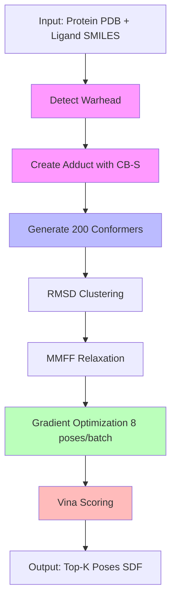

# Usage Guide

## CLI Usage

### Single Ligand

```bash
uv run python scripts/run_covalent_pipeline.py \
  -p examples/6lu7/6lu7_pocket.pdb \
  -q "C=CC(=O)Nc1ccccc1" \
  -r CYS145 \
  -o output/ \
  --num_confs 200 \
  --optimize
```

### Batch Docking

```bash
# Prepare ligand library
cat > ligands.smi <<EOF
C=CC(=O)NC  acrylamide_1
C=CC(=O)NCC  acrylamide_2
O=CCc1ccccc1  aldehyde_1
EOF

# Run batch docking
uv run python scripts/run_batch_docking.py \
  -p examples/6lu7/6lu7_pocket.pdb \
  -s ligands.smi \
  -r CYS145 \
  -o batch_results/ \
  --num_confs 200 \
  --optimize
```

## Python API

### Single Ligand

```python
from cov_vina import run_covalent_pipeline

result = run_covalent_pipeline(
    protein_pdb="examples/6lu7/6lu7_pocket.pdb",
    query_ligand="C=CC(=O)Nc1ccccc1",
    reactive_residue="CYS145",
    output_dir="output/",
    num_confs=200,
    optimize=True,
)

print(f"Best score: {result.best_score:.3f} kcal/mol")
print(f"Output: {result.output_file}")
```

### Batch Docking

```python
from cov_vina import run_batch_docking

# Single SMILES
results = run_batch_docking(
    protein_pdb="examples/6lu7/6lu7_pocket.pdb",
    ligands="C=CC(=O)NC",
    reactive_residue="CYS145",
    output_dir="output/",
)

# List of SMILES
results = run_batch_docking(
    protein_pdb="examples/6lu7/6lu7_pocket.pdb",
    ligands=["C=CC(=O)NC", "C=CC(=O)NCC", "O=CCc1ccccc1"],
    reactive_residue="CYS145",
    output_dir="output/",
)

# .smi file
results = run_batch_docking(
    protein_pdb="examples/6lu7/6lu7_pocket.pdb",
    ligands="ligands.smi",
    reactive_residue="CYS145",
    output_dir="output/",
)

# Check results
for r in results:
    if r['success']:
        print(f"{r['name']}: {r['best_score']:.3f} kcal/mol ({r['num_poses']} poses)")
    else:
        print(f"{r['name']}: FAILED - {r['error']}")
```

## Pipeline Process



### Pipeline Stages

1. **Warhead Detection** - Auto-detect reactive group (acrylamide, aldehyde, etc.)
2. **Adduct Formation** - Create covalent bond with CYS:CB-S (1.82 Å)
3. **Conformer Generation** - RDKit ETKDG, 200 conformers
4. **RMSD Clustering** - Reduce to representative poses
5. **MMFF Relaxation** - Quick geometry cleanup (CB-S frozen)
6. **Gradient Optimization** - Vina score minimization (batch_size=8, CB-S frozen)
7. **Scoring** - Final Vina ranking
8. **Output** - Top-K poses with metadata

### Performance

| Ligands | Time  | Per-Ligand |
|---------|-------|------------|
| 1       | 0.55s | 0.55s      |
| 10      | 2.4s  | 0.24s      |
| 100     | 24s   | 0.24s      |

**Optimizations Applied:**
- Pocket caching (reuse for all ligands)
- GPU warmup (pre-compile CUDA kernels)
- Batch GPU optimization (8 poses simultaneously)

## Common Parameters

```bash
-p, --protein          Protein pocket PDB
-q, --query_ligand     SMILES or SDF file
-r, --reactive_residue CYS145 or CYS145:A (optional, auto-detect)
-o, --out_dir          Output directory
-n, --num_confs        Conformers to generate (default: 200)
--optimize             Enable gradient optimization
--opt_steps            Optimization steps (default: 100)
--optimizer            adam | adamw | lbfgs (default: adam)
```

## Output Files

```
output/
├── covalent_poses_all.sdf      # All poses
├── covalent_poses_top10.sdf    # Top 10 by score
└── docking_summary.json        # Metadata
```

### SDF Metadata

Each pose includes:
- `Vina_Score_Final`: Final Vina score (kcal/mol)
- `CovVina_Warhead_Type`: Detected warhead (e.g. "acrylamide")
- `CovVina_Reactive_Atom_Idx`: Ligand atom forming bond
- `CovVina_Anchor_Residue`: Protein residue (e.g. "CYS145:A")
- `CovVina_Bond_Length`: Covalent bond length (Å)

## Supported Warheads

**Michael Acceptors:** acrylamide, acrylate, enone, vinyl sulfonamide, maleimide
**Alpha-Halo:** chloroacetamide, bromoacetamide, iodoacetamide
**Strained Rings:** epoxide, aziridine
**Reversible:** aldehyde, cyanoacrylamide
**Others:** disulfide, sulfonyl fluoride

## Troubleshooting

**No warhead detected:**
```
Error: No reactive warhead detected
```
→ Check SMILES for supported warhead patterns

**No reactive residue:**
```
Error: No reactive residue found in pocket
```
→ Ensure pocket contains CYS (SER/LYS support coming)

**GPU out of memory:**
```bash
--opt_batch_size 4  # Reduce batch size
```
