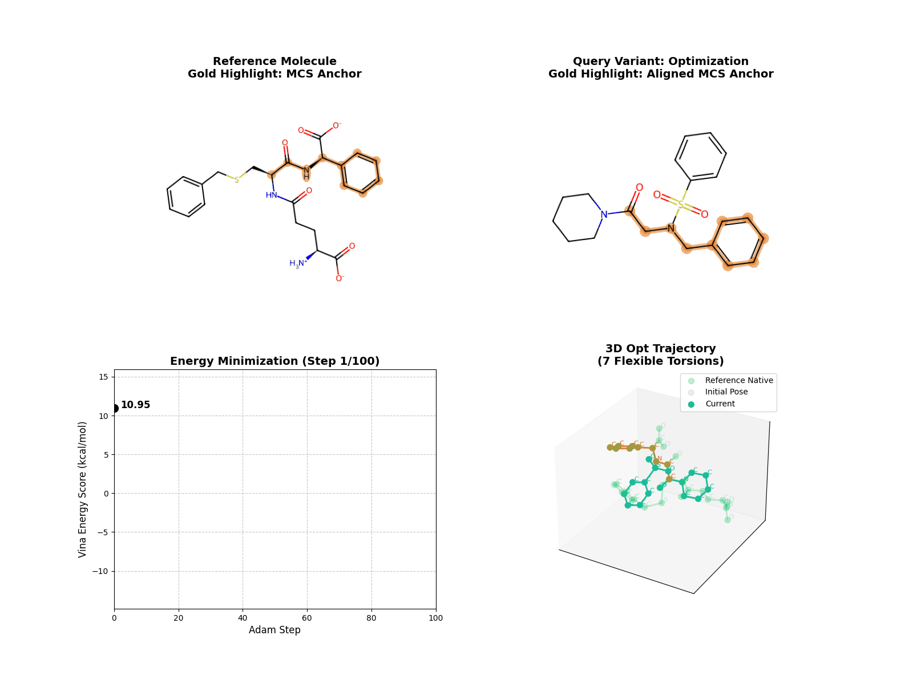
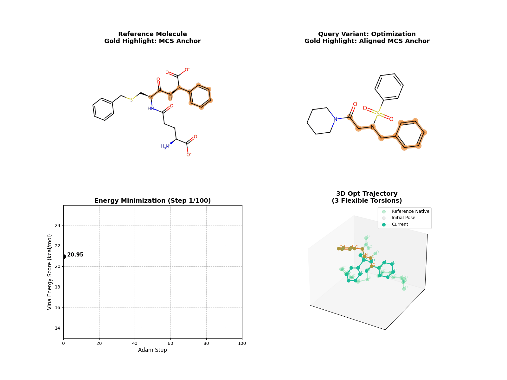
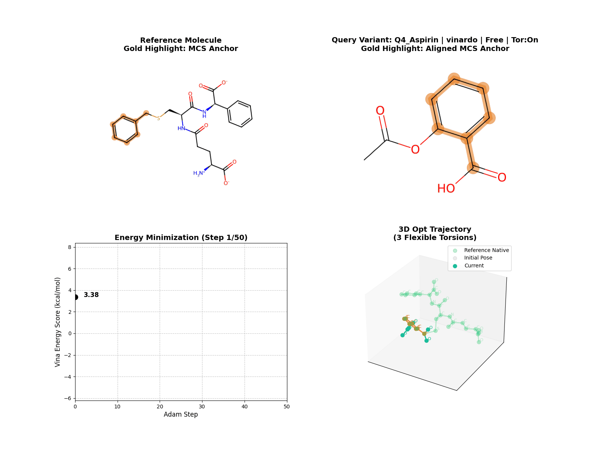
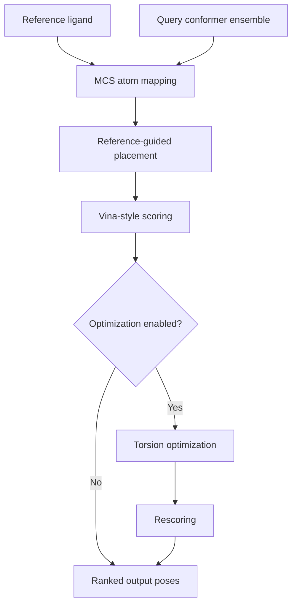

# Weekly Report: 2026-03-06

## Summary

This week focused on stabilizing the MCS-guided ligand alignment pipeline, validating visualization outputs, and organizing the repository for easier external review.

## What Was Completed

- packaged the repository for Git-based collaboration
- preserved reusable GIF outputs under `examples/10gs/visualizations`
- separated top-level overview from detailed documentation
- created a reporting space for recurring weekly updates

## Current Narrative

LigAlign currently follows a practical flow:

1. generate query conformers
2. identify MCS anchors against the reference ligand
3. place and score poses with differentiable Vina terms
4. optionally refine poses through batched torsion optimization

This makes the project easy to explain in meetings because the algorithm has a clear anchor-based story rather than a purely black-box docking narrative.

Full pipeline view:

- [Open the full pipeline diagram](../docs/ARCHITECTURE.md#pipeline-summary)

## Visual Evidence

### Representative Run

### Reference-Guided Run

### Torsion Penalty Comparison

Penalty off:

Penalty on:

### MCS Constraint Comparison

Fixed MCS:

Free MCS:

### Scoring Preset Snapshots

Vina preset:

Vinardo preset:

### Combinatorial Example

Representative variant:

## Concept Diagram

## Why The Current Approach Matters

- reference-guided alignment keeps the search chemically interpretable
- PyTorch scoring makes optimization and analysis share the same energy model
- GIF outputs make progress visible without requiring the audience to inspect raw SDF files

## Risks And Gaps

- README had grown too large and obscured the actual project entry points
- weekly reporting assets existed, but were not grouped into a presentation-ready structure
- installation and API usage still need one or two smoke-tested command examples on a fresh environment

## Next Actions

- add one benchmark-oriented weekly report with runtime and score deltas
- standardize a small set of “meeting-safe” GIFs for repeated reuse
- tighten package metadata and license information before wider sharing
