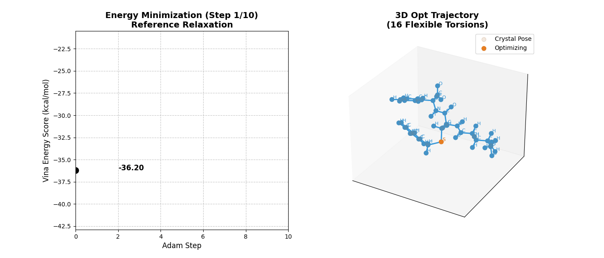
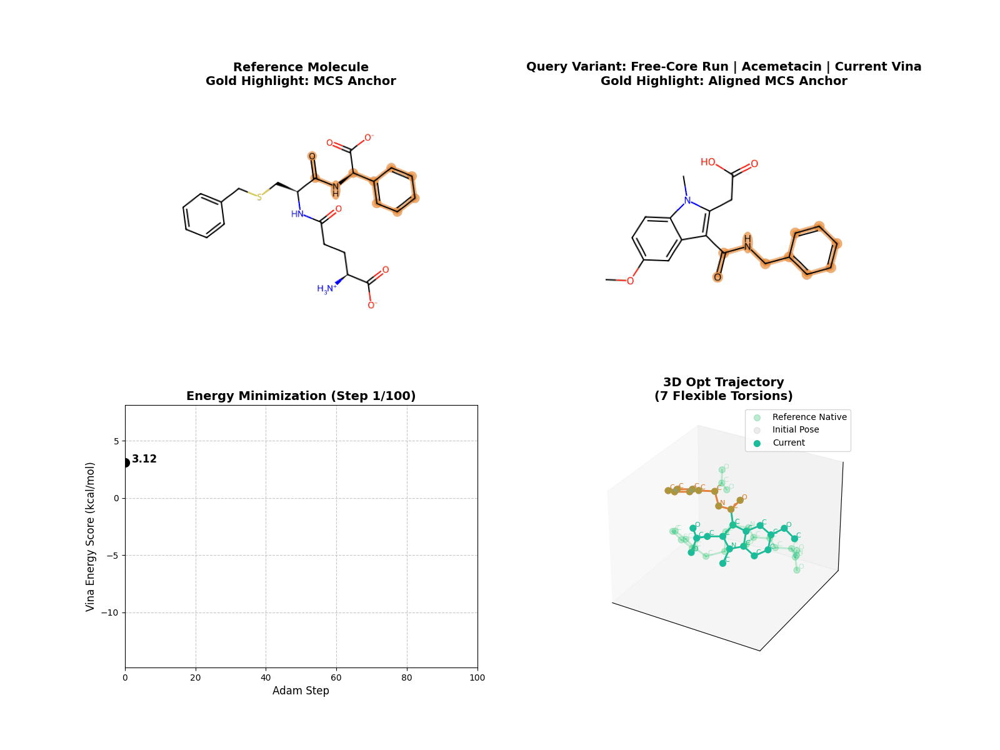
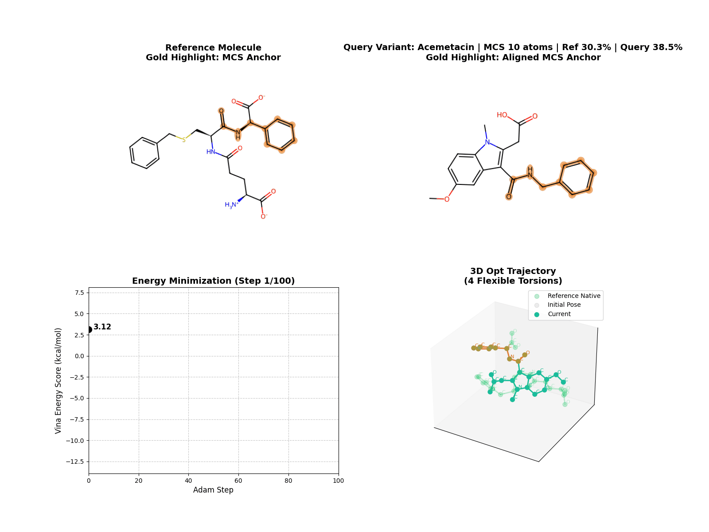
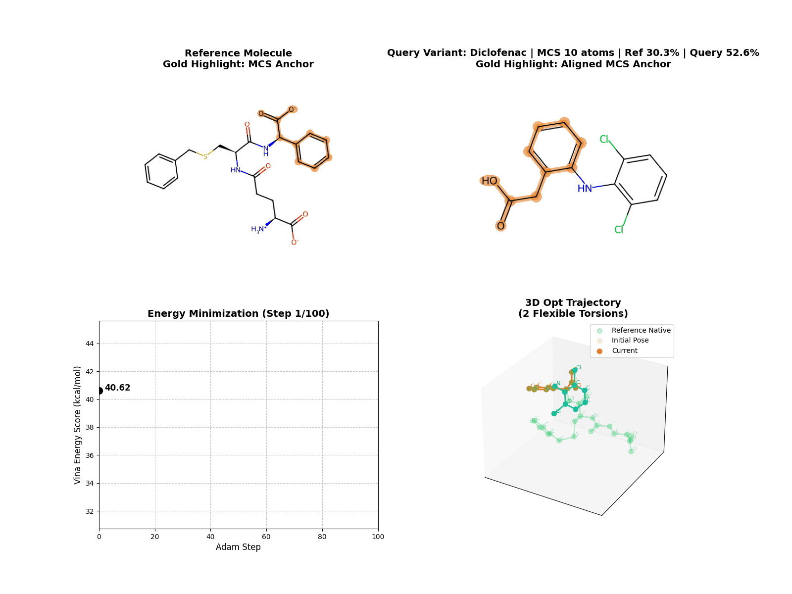
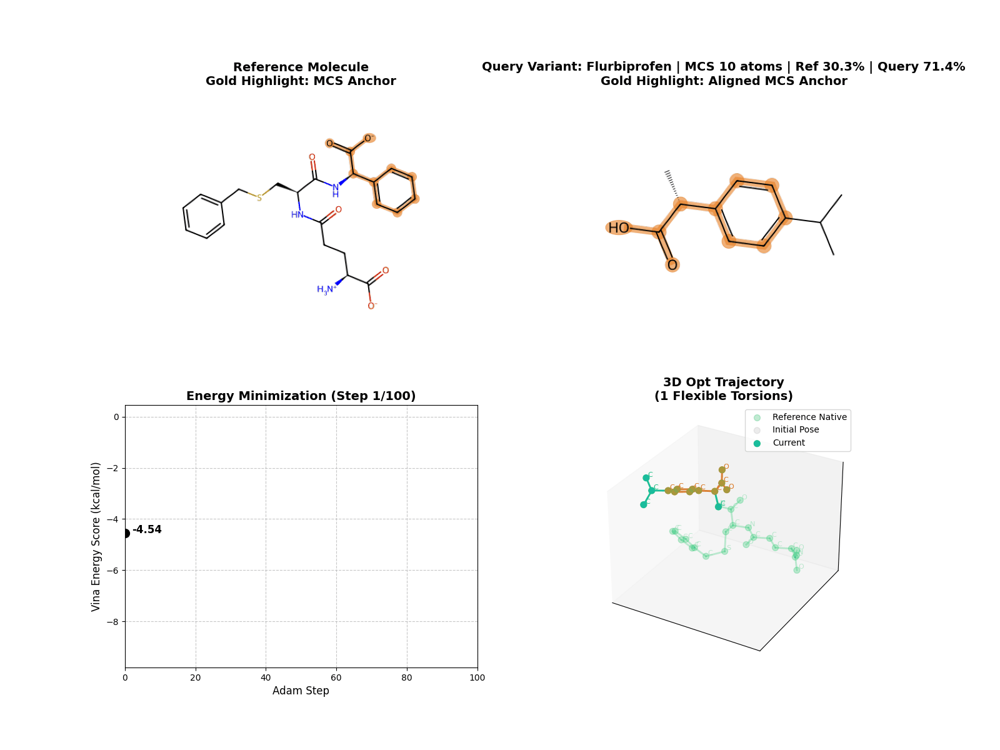
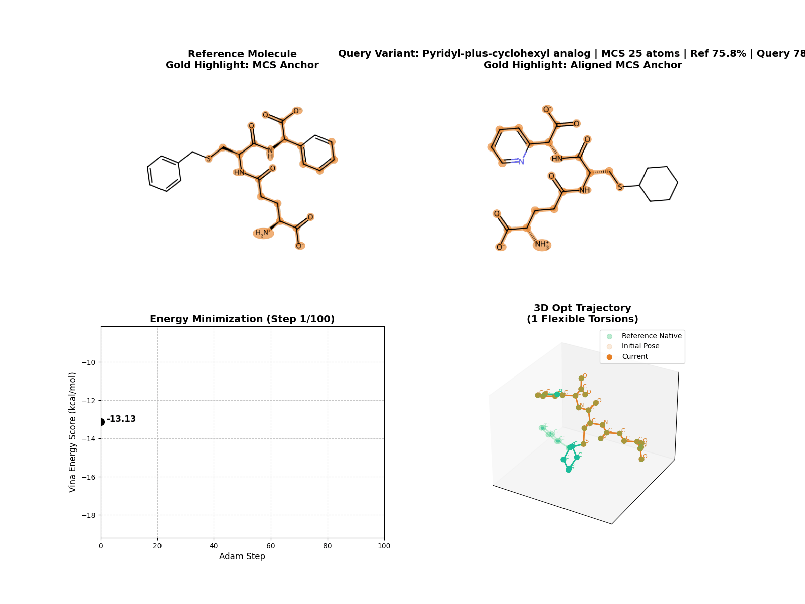
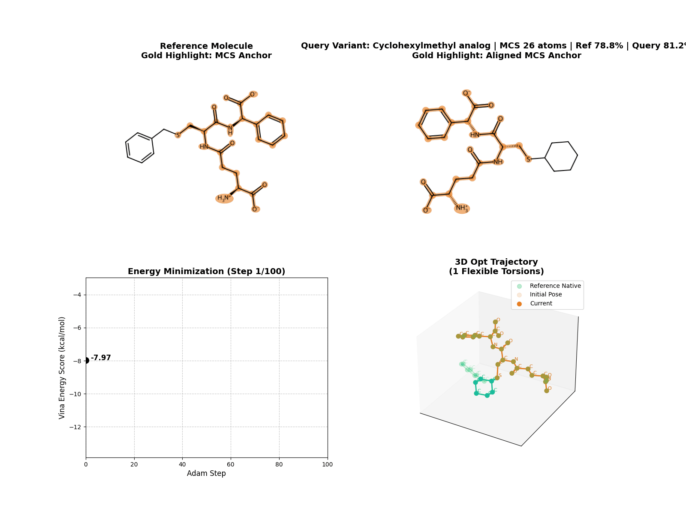

# Progress

## Summary

This report focuses on what the current LigAlign pipeline does, what kinds of reference-guided behavior it can show, and what the latest visualization set demonstrates.

Core idea:

- use the MCS between a reference ligand and a query ligand as an anchor
- generate query conformers around that anchor
- optimize torsions under pocket-based scoring
- compare how the result changes as MCS overlap changes

Architecture reference:

- [Full pipeline diagram](../docs/ARCHITECTURE.md#pipeline-summary)
- [MCS decision rule](../docs/ARCHITECTURE.md#mcs-decision-rule)
- [Full architecture note](../docs/ARCHITECTURE.md)

Quick flow:

1. identify the shared MCS anchor between the reference ligand and the query ligand
2. generate query conformers around that anchor and cluster them into representative poses
3. transfer the query onto the reference anchor and apply constrained relaxation
4. score each representative pose with Vina-style pocket scoring
5. optimize torsions for the surviving poses and export the ranked results

## How It Works

Current pipeline flow:

1. find an MCS between reference and query
2. use the reference MCS coordinates as an anchor for query conformer generation
3. cluster generated conformers and keep representatives
4. place the query onto the reference anchor
5. apply constrained relaxation
6. optimize torsions against the pocket score
7. export poses and score metadata

Current runtime behavior:

- `mcs_mode=auto` chooses between `single`, `multi`, and `cross`
- relaxation safely skips trivial fixed-core cases
- output SDFs record selected mode, relaxation status, and score deltas
- current batched optimization supports multiple poses of the same molecule, not mixed-molecule batches
- reported `Vina` scores now follow the standard formula by default, including the torsional penalty term

## What This Setup Can Show

The current asset set is useful for four questions:

1. What does a representative optimization trajectory look like?
2. What changes when the run is explicitly reference-guided?
3. What changes when the MCS core is fixed vs free during optimization?
4. How does behavior change as overlap increases from the query side and from the reference side?

## Main Results

### Representative Optimization Run

Use:

- the default "what the method looks like in motion" asset

### Reference-Guided Run

Use:

- the clearest short visual for explaining the anchor-guided setup

### Fixed-Core vs Free-Core Optimization

Fixed MCS:

Free MCS:

Use:

- shows how strongly the anchor constraint affects the optimization path

### Query-Coverage View

All GIFs below were rendered with the same `100` optimization steps.

Lower query coverage:

- `Acemetacin`: query `38.5%`, ref `30.3%`, heavy atoms `26`

Mid query coverage:

- `Diclofenac`: query `52.6%`, ref `30.3%`, heavy atoms `19`

Higher query coverage:

- `Flurbiprofen`: query `71.4%`, ref `30.3%`, heavy atoms `14`

Interpretation:

- this view isolates how much of the query ligand is anchored by the shared scaffold

### Reference-Coverage View

This set uses `10gs`-derived analogs instead of unrelated external molecules.

Lower reference coverage:

- `Cyclohexyl-plus-Ala analog`: query `74.1%`, ref `60.6%`, heavy atoms `27`

Mid reference coverage:

- `Pyridyl-plus-cyclohexyl analog`: query `78.1%`, ref `75.8%`, heavy atoms `32`

Higher reference coverage:

- `Cyclohexylmethyl analog`: query `81.2%`, ref `78.8%`, heavy atoms `32`

Interpretation:

- this view isolates how much of the original reference scaffold is retained
- keeping this set below roughly `80%` ref coverage avoids turning the comparison into an almost-native replay

## Visual Asset Summary

| Asset | Query coverage | Ref coverage | Heavy atoms | What it shows |
|---|---:|---:|---:|---|
| Representative run | - | - | - | baseline optimization trajectory |
| Reference-guided run | - | - | - | anchor-guided behavior with the native reference |
| Fixed vs free MCS | varies | varies | varies | effect of keeping the MCS rigid during optimization |
| Acemetacin | 38.5% | 30.3% | 26 | lower query-side overlap |
| Diclofenac | 52.6% | 30.3% | 19 | mid query-side overlap |
| Flurbiprofen | 71.4% | 30.3% | 14 | higher query-side overlap |
| Cyclohexyl-plus-Ala analog | 74.1% | 60.6% | 27 | lower reference-side retention |
| Pyridyl-plus-cyclohexyl analog | 78.1% | 75.8% | 32 | mid reference-side retention |
| Cyclohexylmethyl analog | 81.2% | 78.8% | 32 | higher reference-side retention without becoming near-native replay |

## Runtime Summary

### CPU Baseline

CPU timing was used to identify the main fixed costs in the pipeline.

Conditions:

- device: `CPU`
- pocket: `examples/10gs/10gs_pocket.pdb`
- reference: `examples/10gs/10gs_ligand.sdf`
- conformer generation: `50`
- optimization budget: `100` steps
- relaxation: enabled when applicable

| Molecule | Heavy atoms | Torsions | MCS atoms | Conformer + clustering | Relax | Query feature | Pocket feature | Optimization (100 steps) | Approx. total |
|---|---:|---:|---:|---:|---:|---:|---:|---:|---:|
| Flurbiprofen | 14 | 1 | 10 | 0.301 s | 0.002 s | 0.002 s | 1.758 s | 0.380 s | 2.44 s |
| Diclofenac | 19 | 2 | 10 | 0.310 s | 0.002 s | 0.003 s | 1.758 s | 0.496 s | 2.57 s |
| Acemetacin | 26 | 4 | 10 | 0.700 s | 0.006 s | 0.004 s | 1.758 s | 0.264 s | 2.74 s |
| Cyclohexylmethyl analog | 32 | 1 | 26 | 1.355 s | 0.003 s | 0.006 s | 1.758 s | 0.365 s | 3.50 s |

Main takeaway:

- `MCS` search and constrained relaxation are cheap
- the largest fixed cost is pocket feature construction at about `1.76 s` per run
- for repeated work on one receptor, pocket caching is the first runtime optimization to apply

### GPU Batch Scaling

The main runtime result is the GPU scaling behavior of the current same-molecule multi-pose optimizer.

Conditions:

- device: `cuda`
- query: `Acemetacin`
- seeds: `0, 1, 2`
- optimization budget: `200` steps
- representative poses mean: `16.3`
- torsions: `4`

| Batch size | Early stopping | Total time mean | Total time std | Avg steps mean | Avg steps std | Representative poses mean | Time per pose | Peak alloc | Peak reserved |
|---|---:|---:|---:|---:|---:|---:|---:|---:|---:|
| 1 | off | 14.442 s | 9.488 s | 200.0 | 0.0 | 16.3 | 884.22 ms | 19.5 MB | 24.0 MB |
| 1 | on | 11.772 s | 8.102 s | 151.7 | 14.6 | 16.3 | 720.75 ms | 19.5 MB | 24.0 MB |
| 2 | off | 7.772 s | 4.676 s | 200.0 | 0.0 | 16.3 | 475.86 ms | 21.3 MB | 26.7 MB |
| 2 | on | 7.086 s | 4.657 s | 156.1 | 19.6 | 16.3 | 433.81 ms | 21.3 MB | 26.7 MB |
| 4 | off | 4.262 s | 2.083 s | 200.0 | 0.0 | 16.3 | 260.91 ms | 24.9 MB | 30.7 MB |
| 4 | on | 3.848 s | 2.332 s | 151.5 | 14.9 | 16.3 | 235.57 ms | 24.9 MB | 30.7 MB |
| 8 | off | 2.494 s | 0.881 s | 200.0 | 0.0 | 16.3 | 152.70 ms | 32.4 MB | 48.0 MB |
| 8 | on | 2.213 s | 1.193 s | 148.7 | 12.9 | 16.3 | 135.52 ms | 32.4 MB | 48.0 MB |
| 16 | off | 1.652 s | 0.197 s | 200.0 | 0.0 | 16.3 | 101.16 ms | 46.7 MB | 61.3 MB |
| 16 | on | 1.398 s | 0.568 s | 149.6 | 13.6 | 16.3 | 85.58 ms | 46.7 MB | 61.3 MB |
| 32 | off | 1.066 s | 0.225 s | 200.0 | 0.0 | 16.3 | 65.26 ms | 61.3 MB | 70.7 MB |
| 32 | on | 0.810 s | 0.149 s | 151.7 | 14.6 | 16.3 | 49.57 ms | 61.3 MB | 70.7 MB |

Interpretation:

- GPU batch scaling is now clear and monotonic for same-molecule multi-pose optimization
- `batch_size=32` reduced runtime by about `13.6x` relative to `batch_size=1`
- peak allocated VRAM rose from `19.5 MB` to `61.3 MB`, which is small relative to the observed speedup
- early stopping remained useful across all batch sizes, typically reducing the mean step count from about `200` to about `150`
- the current implementation is therefore compute-limited rather than VRAM-limited for this workload

Operational decision:

- the default `opt_batch_size` is now set to `128`
- this is intended for the current same-molecule batched optimizer on GPU
- users should reduce it manually when a query yields many representative poses or when working in tighter GPU-memory environments
- this report directly validates scaling up to `32`; the `128` default is an operating choice rather than a measured optimum

## Current Limitations

- batching currently covers multiple poses of the same molecule, not mixed-molecule batches
- `multi` and `cross` still enumerate alternatives but continue with the first candidate
- runtime variance remains sensitive to how many representative poses survive clustering
- the `opt_batch_size=128` default has not yet been benchmarked in this report beyond `32`

## Recommended Improvements

1. validate `opt_batch_size=64` and `128` on heavier ligands and larger representative-pose sets
2. support mixed-molecule batching rather than only same-molecule multi-pose batches
3. evaluate more than the first `multi` or `cross` MCS candidate
4. reduce the final presentation asset pack to a smaller canonical set
