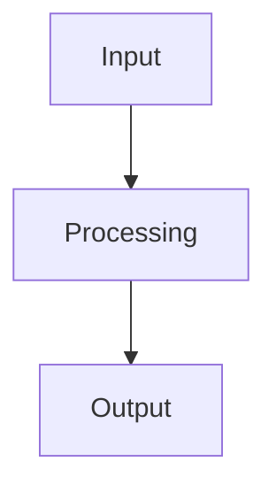

# Weekly Report: YYYY-MM-DD

## Summary

One short paragraph describing what changed and why it matters.

## What Was Completed

- item
- item
- item

## Current Narrative

1. step
2. step
3. step
4. step

## Visual Evidence

### Representative Run

### Additional Asset

## Concept Diagram

## Useful Links

- [Full pipeline diagram](../docs/ARCHITECTURE.md#pipeline-summary)
- [MCS decision rule](../docs/ARCHITECTURE.md#mcs-decision-rule)

## Risks And Gaps

- item
- item

## Next Actions

- item
- item
